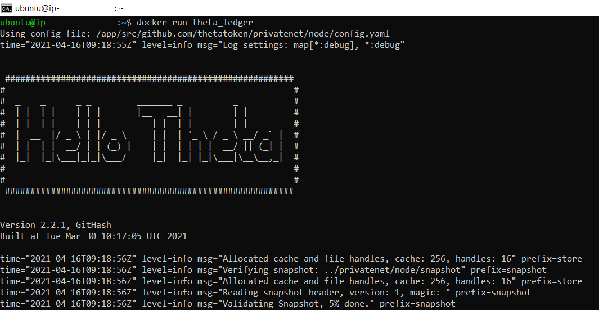
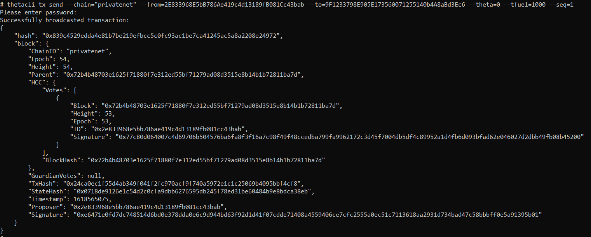
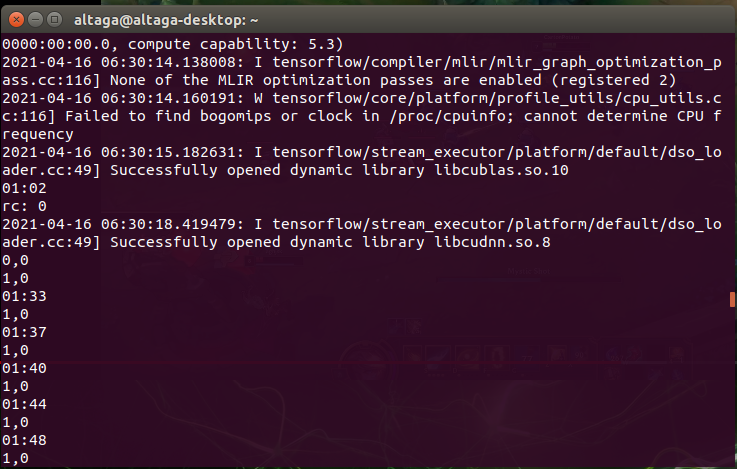
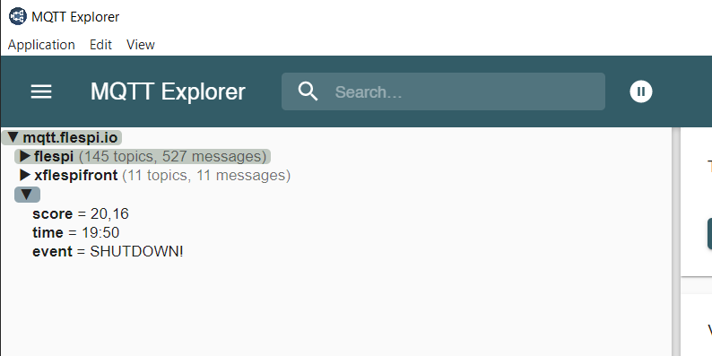

# Dedpool powered by Theta
 Dedpool Dynamic Gambling for League of Legends Powered by Theta

 # Table of Contents:

- [Dedpool powered by Theta](#dedpool-powered-by-theta)
- [Table of Contents:](#table-of-contents)
- [Introduction:](#introduction)
- [Solution:](#solution)
- [Software and Services:](#software-and-services)
- [General Diagram:](#general-diagram)
  - [Backend:](#backend)
  - [Frontend:](#frontend)
  - [Logic Examples:](#logic-examples)
- [AI Diagram:](#ai-diagram)
- [Demo Real Time:](#demo-real-time)
- [VM Setup:](#vm-setup)
- [Cool Video:](#cool-video)

# Introduction:

ALETS

# Solution:

ALETS

# Software and Services:

Software:
- Docker:
https://www.docker.com/
- Python:
https://www.python.org/
- Golang:
https://golang.org/
- OpenCV:
https://opencv.org/
- NodeJS:
https://nodejs.org/
- ReactJS:
https://reactjs.org/

Services:

- AWS EC2:
https://aws.amazon.com/aws/ec2
- AWS S3:
https://aws.amazon.com/aws/s3
- Flespi MQTT:
https://flespi.com
- TensorFlow:
https://www.tensorflow.org
- Theta Ledger:
https://github.com/thetatoken/theta-protocol-ledger

# General Diagram:

## Backend:
Del lado de backend tenemos 2 servidores corriendo al mismo tiempo.

Uno de los servidores, en este caso un AWS EC2, CPU x64. Este corriendo el Ledger de theta, el cual se encarga de confirmar y ejecutar todas las transacciones de nuestro sistema de apuestas.

Transaction Example:

El segundo servidor el cual es un CPU ARM Cortex-A57 con GPU NVIDIA Maxwell 128. Esta realizando el analisis en tiempo real de las partidas transmitidas por Theta.tv en tiempo real, osea que realiza el analisis de la partida mientras el streamer esta transmitiendola.

 

Para este POC se decidio que el juego ideal para realizar esto seria LOL debido a su pronunciada popularidad a lo largo de los años.

La transmision de informacion de los servidores y la plataforma web es mediante MQTT, debido a su excelente tiempo de respuesta.

 

## Frontend:

La plataforma Dedpool recibe los datos directamente de la partida mediante MQTT y mediante logica sencilla va manipulando las apuestas de tal forma que estas sean dinamicas a lo largo de la partida, aqui algunos ejemplos de la logica de la plataforma.

## Logic Examples:

Win Event:

|     Score Board                      | Score  |
|--------------------------------------|--------|
|     > 3 kills for the allied team      | 2:1    |
| > 3   kill against the allied team     | 1:2    |
| > 6   kills for the allied team        | 3:1    |
| > 6   kill against the allied team     | 1:3    |
| > 10   kills for the allied team       | 5:1    |
| > 10   kill against the allied team    | 1:5    |
| > 15   kills for the allied team      | 10:1   |
| > 15   kill against the allied team   | 1:10   |
| > 30   kills for the allied team      | 50:1   |
| > 30   kill against the allied team   | 1:50   |
| > 50   kills for the allied team      | 100:1  |
| > 50   kill against the allied team   | 1:100  |
| > 100   kills for the allied team     | 1000:1 |
| > 100   kill against the allied team  | 1:1000 |

First Blood Event:

| Timer                      | Bet  |
|----------------------------|------|
| 30 Seconds to 2:00 minutes | 1:10 |
| 2:00 to 3:00 minutes       | 1:5  |
| 3:00 to 4:00 minutes       | 1:3  |
| after 4:00 minutes         | 1:1  |

# AI Diagram:

Los eventos, score y tiempo de partida se realizan mediante el analisis de los caracteres en pantalla, utilizando una libreria de reconocimiento de caracteres como lo es Tesseract OCR de Google, para los eventos durante el juego y modelos de machine learning basados en mnist mediante el framework de tensorflow, especialmente entrenados para reconocer caracteres mas especificos como el score y el tiempo de partida.

# Demo Real Time:

https://youtu.be/fRAGp-0K0b0

# VM Setup:

Original Repository: https://github.com/thetatoken/theta-protocol-ledger

Para poder instalar la ledger de Theta, tuvimos que realizar una maquina virtual x84.

Toda la instalacion se realizo mediante un contenedor de Docker, debido a su facilidad de exportabilidad e instalacion.

Para poder instalar el contenedor y correrlo adecuadamente tenemos que instalar Docker en la computadora que va a ser utilizada y una vez instalador correr los siguientes comandos.

    docker build -t Theta_Ledger .
    docker run Theta_Ledger

Todos los detalles de el contenedor estan en el Dockerfile

# Cool Video:

https://youtu.be/W4QksA5qlTU