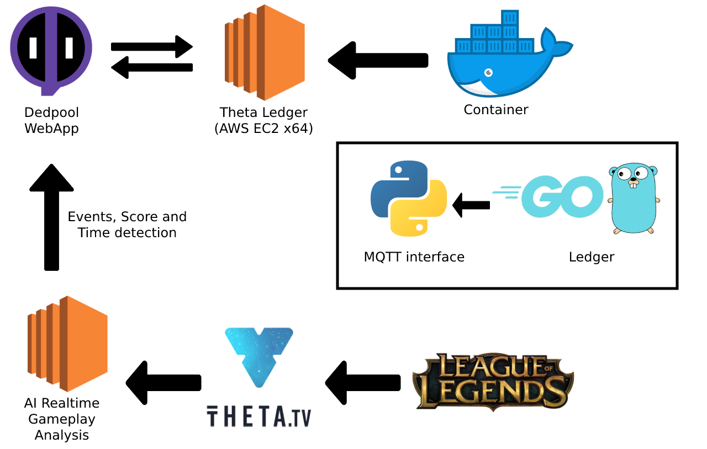
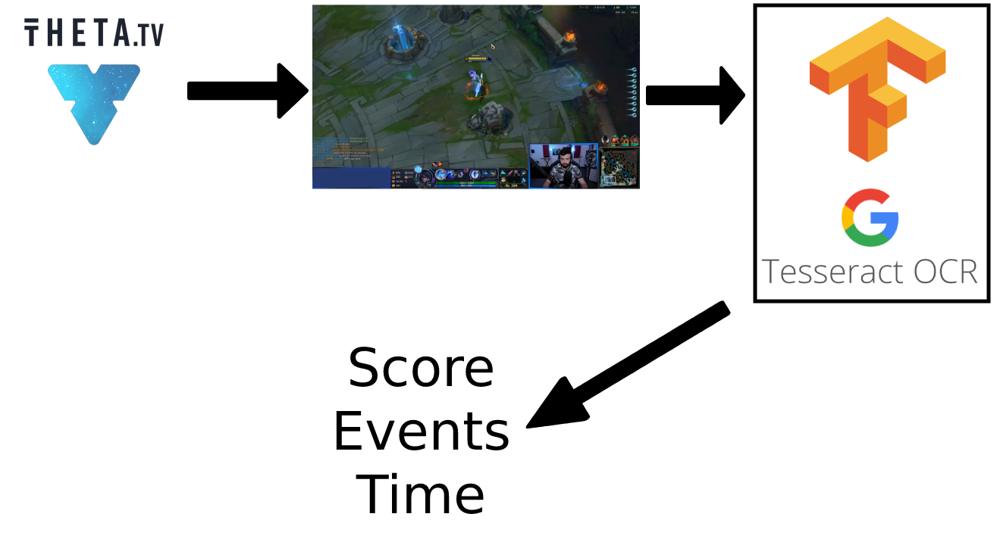

# Dedpool powered by Theta
 Dedpool Dynamic Gambling for League of Legends Powered by Theta

 # Table of Contents:

- [Dedpool powered by Theta](#dedpool-powered-by-theta)
- [Table of Contents:](#table-of-contents)
- [Introduction:](#introduction)
- [Solution:](#solution)
- [Software and Services:](#software-and-services)
- [General Diagram:](#general-diagram)
- [AI Diagram:](#ai-diagram)
- [VM Setup:](#vm-setup)
- [Platform:](#platform)

# Introduction:

ALETS

# Solution:

ALETS

# Software and Services:

Software:
- Docker:
https://www.docker.com/
- Python:
https://www.python.org/
- Golang:
https://golang.org/
- OpenCV:
https://opencv.org/
- NodeJS:
https://nodejs.org/
- ReactJS:
https://reactjs.org/

Services:

- AWS EC2:
https://aws.amazon.com/aws/ec2
- AWS S3:
https://aws.amazon.com/aws/s3
- Flespi MQTT:
https://flespi.com
- TensorFlow:
https://www.tensorflow.org
- Theta Ledger:
https://github.com/thetatoken/theta-protocol-ledger

# General Diagram:

# AI Diagram:

# VM Setup:

Original Repository: https://github.com/thetatoken/theta-protocol-ledger

Para poder instalar la ledger de Theta, tuvimos que realizar una maquina virtual x84.

Toda la instalacion se realizo mediante un contenedor de Docker, debido a su facilidad de exportabilidad e instalacion.

Para poder instalar el contenedor y correrlo adecuadamente tenemos que instalar Docker en la computadora que va a ser utilizada y una vez instalador correr los siguientes comandos.

    docker build -t Theta_Ledger .
    docker run Theta_Ledger

Todos los detalles de el contenedor estan en el Dockerfile

# Platform:

d65fjqaa1szhj.cloudfront.net